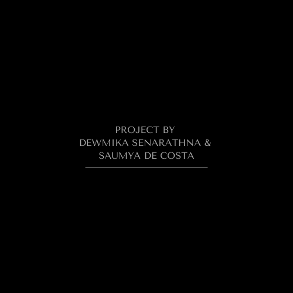

## 📌 Project Title: **Signal Processing for Audio Classification**

<div align="center">
  
</div><br>


---

### 🧠 Overview

This project presents a **two-part audio classification system** developed using **MATLAB**, leveraging **signal processing** and **feature engineering** techniques. The goal is to classify audio signals based on their spectral characteristics using a combination of **MFCCs, FFT**, and **energy ratio features**, along with **filter design**, **distance-based classification**, and **k-Nearest Neighbors (k-NN)** algorithms.

The system is capable of detecting and classifying unknown or test audio files into distinct classes, such as emergency vehicle sounds, using a custom-built DSP pipeline.

---

### 🧑‍💻 Contributors

* **Dewmika Senarathna**
* **Saumya De Costa**

---

### 📂 Project Structure

```
📁 Task_02/Task_02_Part_01/Part 01/
├── class_1/
├── class_2/
├── unknown/
└── audio_classification_Part1.m
```

```
📁 Task_02/Task_02_Part_02/part 02
├── Filter
│   ├── train/
│   │   ├── ambulance/
│   │   └── firetruck/
│   ├── test/
│   │   ├── ambulance/
│   │   └── firetruck/
└── filter_classification_part2.m      
```

---

### 🎯 Task 01 – **Hybrid Audio Classification (MFCC + FFT)**

* **Objective**: Classify unknown audio clips into 'class_1' or 'class_2'
* **Techniques Used**:
  * Bandpass Filtering (700–2000 Hz)
  * MFCC (13 Coefficients)
  * FFT (Mean & Std of Spectral Magnitude)
  * Feature Normalization
  * Centroid-Based Classification with Euclidean Distance

* **Key Feature**: 
  *Hybrid feature vector = weighted combination of MFCC, FFT mean, and FFT std

---

### 🎯 Task 02 – **Filter-Based Emergency Sound Classifier**

* **Objective**: Classify emergency vehicle sounds as 'ambulance' or 'firetruck'
* **Techniques Used**:
  * Designed 3 Bandpass Filters (500–4200 Hz)
  * Extracted Energy from Filtered Signals
  * Calculated Energy Ratios as Features
  * Trained a 'k-NN' Classifier (k=3)

* **Output**: Printed prediction for each test file and overall classification accuracy

---

### 🛠️ Tools and Technologies

* MATLAB
* Signal Processing Toolbox
* Audio Toolbox
* Feature Engineering
* k-NN Classifier
* Euclidean Distance Metrics

---

### 📈 Results

* **Task 01**: Classified unknown audio using feature normalization and centroid comparison
* **Task 02**: Achieved high accuracy classifying ambulance and firetruck sounds using energy ratio features
* Final results are printed to the console, showing predicted vs. actual classes

---

### ✅ How to Run

1. Open MATLAB
2. Navigate to 'Task_02_Part_01' folder
3. Run:

   ```matlab
   audio_classification_Part1
   ```

4. Then, navigate to 'Task_02_Part_02' folder

5. Run:

   ```matlab
   filter_classification_part2
   ```

Ensure audio files are properly structured inside their folders ('train', 'test', 'class_1', etc.).

---

### 📚 Acknowledgments

This project was completed as part of a **Digital Signal Processing(DSP)** academic module, emphasizing practical application of theoretical concepts in audio recognition.

---

### 📎 License

MIT License

---

<div align="center">
  
</div><br>

---
